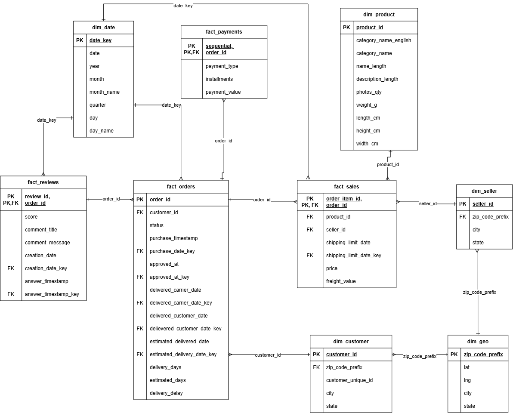

# Olist E-Commerce end-to-end Analytics

## 1. Project Overview
   #### Objective
   The objective of this project is to develop an end-to-end data pipeline and business intelligence solution using the Brazilian E-Commerce Public Dataset by Olist. Python and Pandas are used for data cleaning, transformation, and preparation, while MySQL is used to implement a structured dimensional data warehouse. SQL transformations and analytical views are then used to prepare the data for Power BI, where interactive dashboards are developed to evaluate sales, delivery performance, seller performance, and other key business metrics.

#### Tech Stack:
**Data Processing:** Python, Pandas  
**Database:** MySQL, SQL  
**Business Intelligence:** Power BI, DAX
## 2. Business Questions
   #### Shipping Efficiency
   + Which seller has the fastest and the slowest average delivery time?
   + How long does the delivery take by state or region?
   + How often are orders delivered before or after the estimated delivery date?
   #### Payment Method Performance
   + Which payment methods generate the highest sales?
   + Do customers using certain payment methods spend more?
   + How are payment installments distributed across orders?

## 3. Dataset
   The dataset was extracted from kaggle. It is Brazilian E-Commerse Public dataset of orders at Olist Store. It is comprised of over 100,000 orders from late 2016 to early 2018 from various Brazilian Marketplace. The dataset contains information about orders, customers, sellers, products, payments, reviews, and geographic locations.

   The dataset consists of multiple related CSV files, which were used as the raw source data for the project's data pipeline. These datasets were cleaned and transformed using Python before being loaded into a MySQL database for structured storage and analysis.

   The main datasets used in this project include:
   + Orders
   + Order Items
   + Customers
   + Sellers
   + Products
   + Payments
   + Reviews
   + Geolocation

   Source: [Brazilian E-Commerce Public Dataset by Olist — Kaggle](https://www.kaggle.com/datasets/olistbr/brazilian-ecommerce)

## 4. Project Architecture

  

### Olist Raw Datasets
This is the source of the data that contains orders, products, sellers, customers, payments, reviews and geolocations.
### Python/Pandas
Python specifically Pandas library was used to clean and transform the raw datasets and prepare derived fields for analysis.
### MySQL Dimensional Model
The prepared data was stored in fact and dimension tables for analytical queries.
### SQL Views and Aggregations
Created analysis-ready views and aggregated data while accounting for different table grains.
### Power BI
Built DAX measures and interactive visualizations for the final analysis.
### Business Insights
Used the dashboard to evaluate shipping efficiency and payment method performance

## 5. Data Modeling

  

The project uses a dimensional data model using a galaxy schema with some snowflaked dimensions. It is consisting of transactional fact tables and descriptive dimension tables. *fact_sales, fact_orders, fact_payments,* and *fact_reviews* store transactional data, while dimensions such as *dim_product, dim_customer, dim_seller, dim_date,* and *dim_geo* provide descriptive attributes for analysis. Primary and foreign key relationships connect the tables and allow the data to be analyzed across orders, products, sellers, customers, payments, and dates.

The tables maintain different grains: *fact_sales* is at the order-item level, *fact_orders* is at the order level, and *fact_payments* and *fact_reviews* contain multiple records that can be associated with an order.

## 6. Business Analysis

### Shipping Efficiency
This dashboard analyzes the efficiency and reliability of order deliveries. It provides an overview of delivery performance through key metrics such as total orders, average delivery time, and delivery status. Seller-level and time-based analysis allows delivery performance to be compared across sellers and monitored over time.

This dashboard also includes seller performance rankings, delivery status distribution and monthly delivery
### Payment Method Performance
This dashboards analyzes the performance of different payment methods and customer payment behavior using transaction volume, payment value, customer spendings and installment information

## 7. Key Insights

### Shipping Efficiency
+ Seller df683df... had the slowest average delivery time at approximately 190 days, while Seller 139157d... had the fastest at approximately 1.2 days. This represents a substantial difference in delivery performance across sellers, with the slowest seller taking more than six months on average.
+
### Payment Method Performance

## 8. Challenges & Data Limitations

Short explanations of important issues encountered.